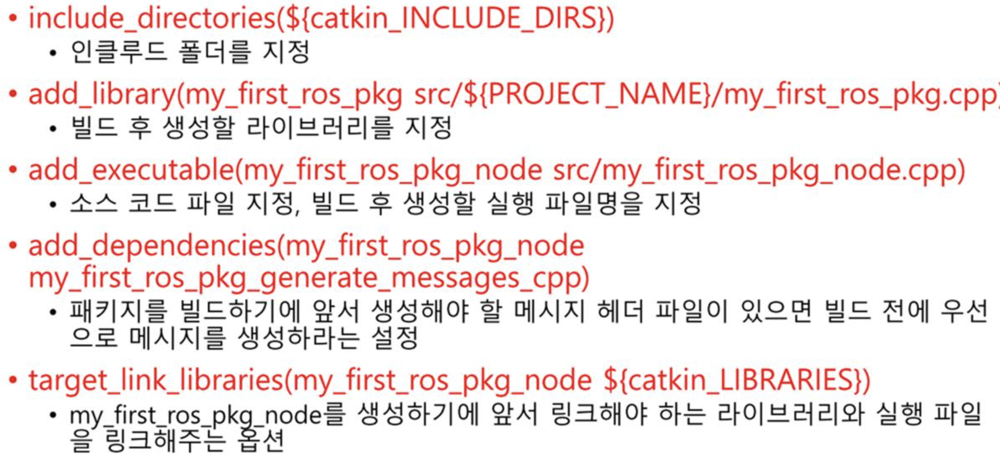

## ROS

> Robot Operating System

*로봇 응용 프로그램 개발을 위한 OS*

- ROS는 **메타 운영체제**
  - 기존 전통적인 운영체제의 프로세스 관리 시스템, 파일 시스템, UI 등을 이용
  - **로봇 응용 개발에 필수적인 로봇 및 센서의 하드웨어 추상화 개념으로 이를 제어하고 저의 로봇 응용 프로그램 개발 위한 지원 시스템**


Ubuntu18.04 버전에선 ROS melodic 을 설치한 뒤 사용합니다.


### ROS 용어

- Node 
  - 최소 단위의 실행가능한 프로세서
  - 프로그램을 노드 단위로 나누어 작업하게 되며, 각 노드는 메시지 통신으로 데이터를 주고받습니다.
- Package
  - 하나 이상의 노드, 노드 실행을 위한 정보 등을 묶어 놓은 것
  - 패키지의 묶음을 메타패키지라 하여 따로 분리합니다.
- Message
  - 메시지를 통해 노드간의 데이터를 주고받게 됩니다.
  - 메시지는 integer, floating point, boolean과 같은 변수 형태입니다.
  - 메시지 안에 메시지 포함하는 데이터 구조 및 배열 구조도 사용 가능합니다.


### 데이터의 송수신

**Topic, Publisher, Subscriber**

turtle 예제에선 

- turtle_teleop_key : Publisher
- tutlesim_node: Subscriber
- turtle1/cmd_vel : Topic


토픽방식에서는 접속을 끊지 않는 이상 지속적으로 메시지를 전송할 수 있습니다. (연속성)


### Catkin Workspace

```~/catkin_ws``` 위치에서 진행합니다.

- /build

  - 빌드 관련 파일

- /devel

  - msg, src 헤더 파일, 사용자 패키지 라이브러리, 실행 파일 포함

- /src

  - 사용자 패키지 폴더
    
    
  - /include
    - 헤더파일
  - /launch
    - roslaunch 사용되는 런치 파일
  - /node
    - rospy 용 스크립트
  - /msg
    - 메시지 파일
  - /src
    - 코드 소스 파일
  - /srv
    - 서비스 파일
  - CMakeLists.txt
    - 빌드 설정 파일
    - 
    - 
    - 

  

  

  - package.xml
    - 패키지 설정 파일
    - 


### 예제 

#### 1. 패키지 생성

사용자가 패키지 작성 시 catkin build 시스템에 필요한 CMakeLists.txt 와 package.xml 을 포함한 패키지 폴더를 생성한다.

```bash
$ catkin_create_pkg [패키지 이름] [옵션: 의존하는 패키지; 여러개 가능] 
```


#### 2. 패키지 설정 파일 수정 (package.xml)

패키지 이름, 라이센스, 패키지 등 수정


#### 3. 빌드 설정 파일 (CMakeLists.txt) 수정

실행 파일 생성, 의존성 패키지 우선 빌드, 링크 생성 등의 빌드 환경 정보

```txt
cmake_minimum_required(VERSION 3.0.2)
project(capstone_practice)

find_package(catkin REQUIRED COMPONENTS
	roscpp
	std_msgs
)

catkin_package(
CATKIN_DEPENDS
	roscpp
	std_msgs
)
include_directories(
	# include
	${catkin_INCLUDE_DIRS}
)

# 노드의 이름을 추가한다
add_executable(capstone_practice src/msg.cpp)
target_link_libraries(msg ${catkin_LIBRARIES})
```


#### 4. 소스코드 작성

```cpp
#include <ros/ros.h>
#include <sstream>
#include <std_msgs/String.h>

# main 문의 원형
int main(int argc, char** argv)
{
  # ros 에서 노드에 대한 정보를 전달해야함
  ros::init(argc, argv, "capstone_practice_node");
  ros::NodeHandle nh;
  
  # queue size: 1000. 두 노드 간 데이터의 송수신 위해 큐 사용
  ros::Publisher capstone_practice_pub = nh.advertise<std_msgs::String>("capstone_topic_name", 1000);
  
  # publisher의 루프 주기 10Hz
  ros::Rate loop_rate(10);
  int count = 0;
  
  while(ros::ok())
  {
    std_msgs::String msg;
    std::stringstream ss;
    ss << "hello world!" << count;
    msg.data = ss.str();
    ROS_INFO("%s", msg.data.c_str());
    capstone_practice_pub.publish(msg);
    ros::spinOnce();
    loop_rate.sleep(); # 10Hz 만큼 쉬게 됨
    ++count;
  }
  return 0;
}
```


질문!

1. 한글 쓰고 싶음...
2. spinOnce ???


